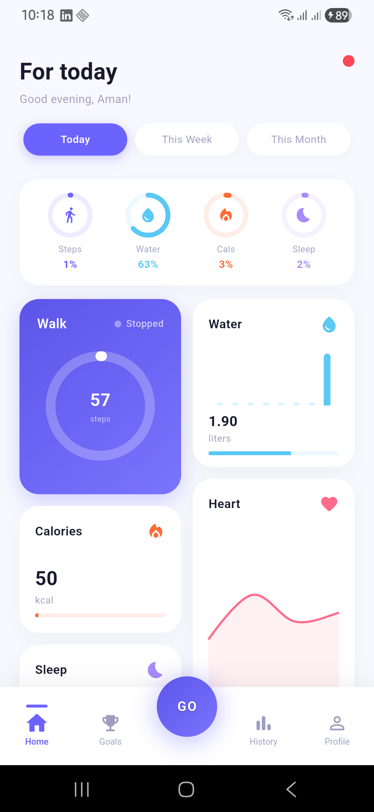
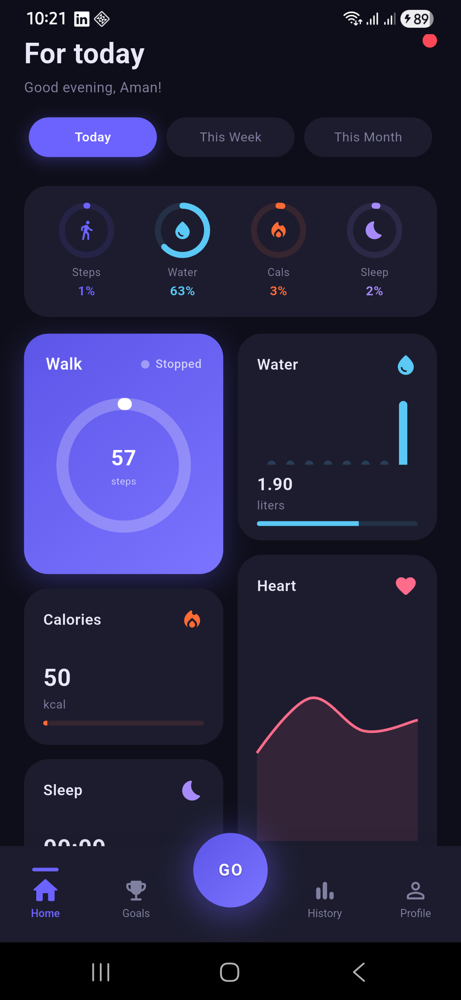
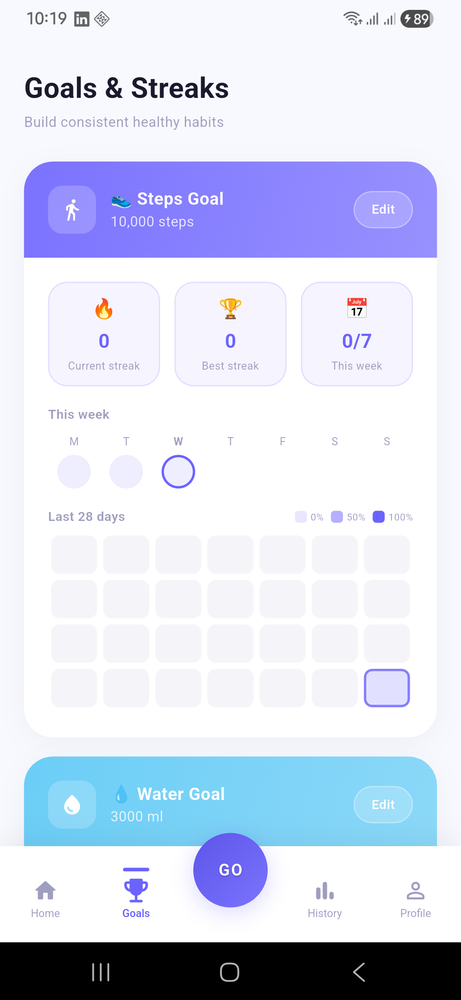
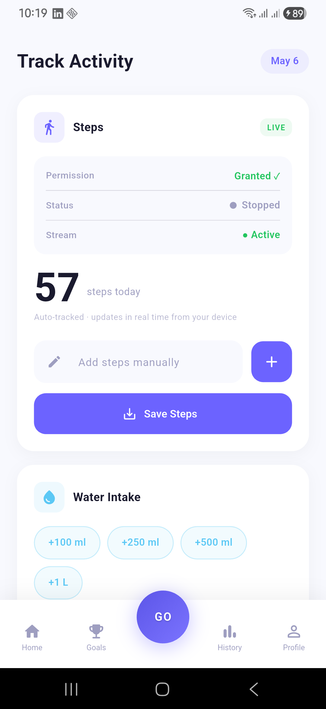
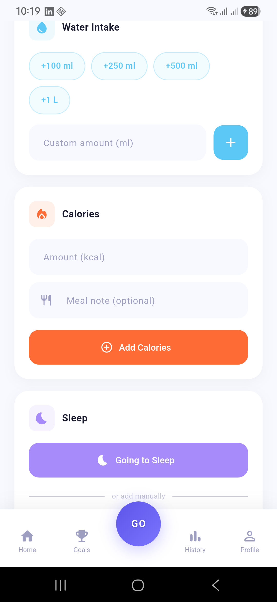
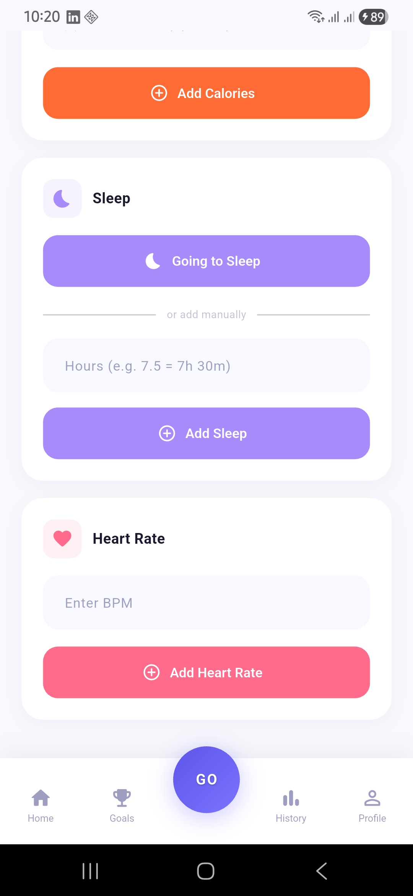
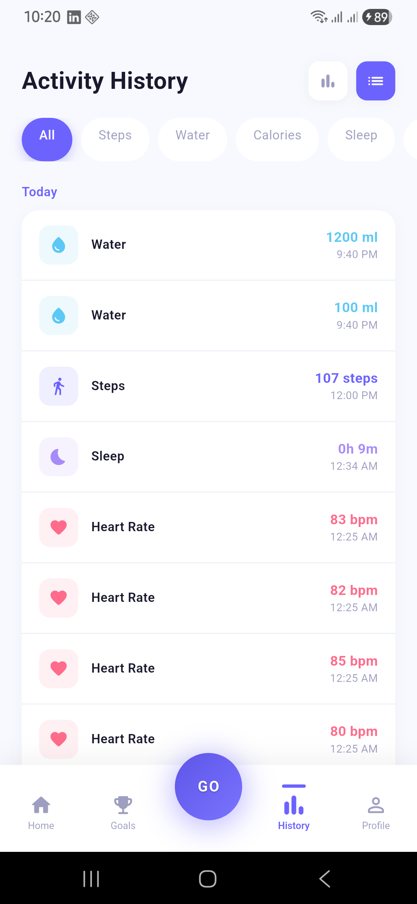
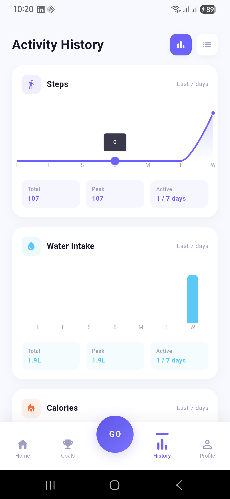
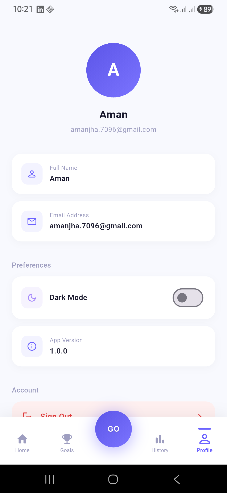

# VitalTrack

A Flutter health activity tracking app that monitors steps, water intake, calories, sleep, and heart rate — backed by Firebase and built on the GetX framework.

---

## Download

[](apk/app-release.apk)

---

## Demo

> GitHub does not play `.mp4` files inline. Click the link below to download and watch the recording.

[▶ Watch screen recording](screenshots/Screen_recording_20260506_222524.mp4)

---

## Screenshots

<table>
  <tr>
    <td align="center"><b>Dashboard · Light</b></td>
    <td align="center"><b>Dashboard · Dark</b></td>
    <td align="center"><b>Goals &amp; Streaks</b></td>
  </tr>
  <tr>
    <td></td>
    <td></td>
    <td></td>
  </tr>
  <tr>
    <td align="center"><b>Track · Steps</b></td>
    <td align="center"><b>Track · Water &amp; Calories</b></td>
    <td align="center"><b>Track · Sleep &amp; Heart Rate</b></td>
  </tr>
  <tr>
    <td></td>
    <td></td>
    <td></td>
  </tr>
  <tr>
    <td align="center"><b>History · Log</b></td>
    <td align="center"><b>History · Charts</b></td>
    <td align="center"><b>Profile</b></td>
  </tr>
  <tr>
    <td></td>
    <td></td>
    <td></td>
  </tr>
</table>

---

## Features

- **Step Tracking** — Live pedometer integration with session-baseline management, manual entry fallback, and 90-second auto-save to Firestore
- **Activity Logging** — Water, calories, sleep sessions (start/wake), and heart rate entries
- **Dashboard** — Today / Week / Month views with progress rings and mini charts per metric
- **Goals & Streaks** — Configurable daily step and water goals; current streak, longest streak, and 28-day heatmap
- **Activity History** — Full log grouped by date with per-type filtering and swipe-to-delete
- **Auth** — Firebase email/password with session persistence and automatic redirect on token expiry
- **Theming** — System-aware dark/light theme with toggle; preference persisted across launches via GetStorage

---

## Architecture

The project follows **GetX MVC** with a **feature-first (module) folder structure**.

```
lib/
├── core/
│   ├── constants/      # AppColors, AppGoals, AppConstants
│   ├── controllers/    # ThemeController (global)
│   ├── theme/          # AppTheme (light + dark ThemeData)
│   ├── utils/          # AppUtils (snackbars, helpers)
│   └── widgets/        # Shared UI components
├── data/
│   ├── models/         # ActivityModel
│   ├── repositories/   # ActivityRepository (Firestore queries)
│   └── services/       # FirebaseService (singleton refs)
├── modules/
│   ├── auth/           # Splash, Login, Register + AuthController
│   ├── dashboard/      # Stats overview + DashboardController
│   ├── goals/          # Streak heatmaps + GoalsController
│   ├── history/        # Filtered log + HistoryController
│   ├── main_nav/       # Bottom nav shell + MainNavController
│   ├── profile/        # User profile + ProfileController
│   └── tracking/       # Live sensor + TrackingController
└── routes/             # AppRoutes (constants) + AppPages (GetPage list)
```

**Why GetX MVC + module structure?**

- Each feature is fully self-contained (controller, view, binding, widgets) — easy to add or remove a module without touching other features.
- GetX bindings lazy-load controllers only when the route is active and dispose them automatically on navigation away, keeping memory usage minimal.
- `GetMaterialApp` handles routing, dependency injection, and reactive rebuilds in one place, eliminating the boilerplate of separate Provider/Bloc setup files.

---

## State Management

**GetX** (`get: ^4.6.6`) is used exclusively.

| Mechanism | Usage |
|---|---|
| `.obs` observables | All mutable state (counters, lists, booleans) |
| `Obx(() => ...)` | Reactive widget rebuilds scoped to exactly the observables they read |
| `GetxController` | One controller per module; lifecycle hooks `onInit`, `onReady`, `onClose` |
| `Binding` | Injects controllers at route entry; auto-disposed at route exit |
| `ever(obs, callback)` | Cross-controller reactions (e.g., refresh dashboard when bottom-nav tab changes) |
| `Get.find<T>()` | Locate already-registered controllers without re-creating them |

Local persistence (theme preference, step baseline, sleep session) is handled by **GetStorage** (`get_storage: ^2.1.1`) — a lightweight key-value store that ships with GetX and requires no native setup.

---

## Packages

| Package | Version | Purpose |
|---|---|---|
| `get` | ^4.6.6 | State management, routing, dependency injection |
| `get_storage` | ^2.1.1 | Local key-value persistence (theme, step baseline, sleep state) |
| `firebase_core` | ^3.15.2 | Firebase initialization |
| `firebase_auth` | ^5.7.0 | Email/password authentication |
| `cloud_firestore` | ^5.6.12 | Remote activity storage |
| `pedometer` | ^4.1.1 | Native step count and pedestrian status streams |
| `permission_handler` | ^11.3.0 | Runtime Activity Recognition permission (Android) |
| `fl_chart` | ^1.0.0 | Bar and line charts on dashboard and history screens |
| `intl` | ^0.20.2 | Date formatting (`DateFormat`) |
| `cupertino_icons` | ^1.0.8 | iOS-style icons |

---

## Firebase Setup

This project requires a Firebase project with **Authentication** and **Firestore** enabled.

1. Create a Firebase project at [console.firebase.google.com](https://console.firebase.google.com).
2. Enable **Email/Password** under Authentication → Sign-in method.
3. Create a **Firestore** database (start in test mode for development).
4. Add an Android app and download `google-services.json` → place it at `android/app/google-services.json`.
5. Add an iOS app and download `GoogleService-Info.plist` → place it at `ios/Runner/GoogleService-Info.plist`.
6. Run the FlutterFire CLI to regenerate `lib/firebase_options.dart`:

```bash
dart pub global activate flutterfire_cli
flutterfire configure
```

### Firestore Data Structure

```
users/{uid}/activities/{docId}
  ├── id        : String
  ├── type      : "steps" | "water" | "calories" | "sleep" | "heart"
  ├── value     : Number
  ├── note      : String? (optional)
  └── createdAt : Timestamp
```

Steps use a deterministic document ID (`steps_YYYY-MM-DD`) so daily records upsert rather than append — preventing double-counting across sessions.

### Recommended Firestore Index

All activity queries filter and order on `createdAt`. Add a composite index on the `activities` sub-collection:

- Collection group: `activities`
- Fields: `createdAt` (Ascending)

Firestore will prompt you with a direct console link to create the required index the first time a ranged query runs.

---

## Setup & Run

### Prerequisites

- Flutter SDK `^3.11.4` — [install guide](https://docs.flutter.dev/get-started/install)
- Dart SDK `^3.11.4` (bundled with Flutter)
- Android Studio or Xcode for device/emulator
- A configured Firebase project (see above)

### Steps

```bash
# 1. Clone the repository
git clone <repo-url>
cd tracking

# 2. Install dependencies
flutter pub get

# 3. Place Firebase config files
#    android/app/google-services.json
#    ios/Runner/GoogleService-Info.plist

# 4. Run on a connected device or emulator
flutter run
```

For a release build:

```bash
# Android APK
flutter build apk --release
```

---

## Android Permissions

The following permission is declared in `AndroidManifest.xml` and requested at runtime:

```xml
<uses-permission android:name="android.permission.ACTIVITY_RECOGNITION" />
```

Required for the pedometer on Android 10+. The app gracefully degrades to manual step entry if the permission is denied or permanently denied.

---

## Default Goals

Defined in `lib/core/constants/app_constants.dart` and overridable per-user via the Goals screen (persisted in GetStorage):

| Metric | Default |
|---|---|
| Steps | 10,000 / day |
| Water | 3,000 ml / day |
| Calories | 2,000 kcal / day |
| Sleep | 8 hours / night |

---

## Running Tests

```bash
flutter test
```

The test suite covers controllers and models with pure unit tests — no Firebase calls are made. A shared `FakeActivityRepository` in `test/helpers/` is injected wherever controllers need a repository, keeping tests fast and deterministic.

```
test/
├── helpers/
│   └── fake_repository.dart        # In-memory stub for ActivityRepository
├── models/
│   └── activity_model_test.dart    # JSON serialization / deserialization
└── controllers/
    ├── auth_controller_test.dart
    ├── dashboard_controller_test.dart
    ├── goals_controller_test.dart
    ├── history_controller_test.dart
    ├── main_nav_controller_test.dart
    ├── theme_controller_test.dart
    └── tracking_controller_test.dart
```

> **AI-assisted tests** — The unit tests in this project were written with the help of AI. Given the volume of edge cases (streak boundary conditions, pedometer session-baseline logic, upsert behaviour), AI assistance was used to generate thorough test coverage quickly. All generated tests were reviewed, corrected where needed, and validated against the actual controller implementations before being committed.
